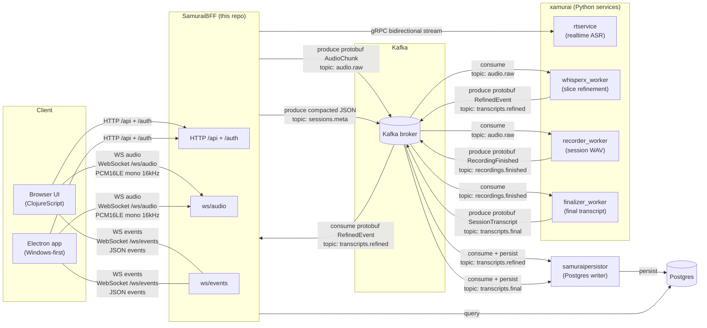

# nanosamurai

Open-source **self-hosted speech-to-text** (STT) stack. 

nanosamur.ai is guarding your sensitive conversations - in your cloud, on your own infrastructure and air-gapped systems.
It is model agnostic - it is the multi-model STT orchestration platform that supports different models used for different use cases (realtime vs semi-realtime vs batch) and provides a unified stack for highly available and robust processing with support for agentic workflows and webhooks.

This is the public front-door repo for running the Community Edition locally
with Docker Compose. Service images are pulled from `ghcr.io/nanosamurai/*`
and pinned by SHA by default.

Community Edition includes the BFF/UI, realtime transcription, asynchronous
refinement and finalization, transcript persistence, recording storage, and an
optional local observability stack. 

Proprietary workflow execution and webhook
delivery services are not included or enabled by default in the Community Edition, but the plumbing for them is there, 
so you are free to implement your own workflows / webhook services and plug them in.

## Architecture

Simplified architecture could be outlined like this:

```text
Browser / SDK
      |
      v
SamuraiBFF ---- gRPC ----> realtime service (xamurai's rtservice service)
      |                         |
      +------ Kafka ------------+
                 |
                 +--> recorder (xamurai's recorder service) --> LocalStack S3 --> finalizer (xamurai's finalizer service)
                 +--> WhisperX semi real-time refinement (xamurai's whisperx_worker service)
                 +--> persistor (samuraipersistor service) --> PostgreSQL
```

Nanosamurai stack currently consists of the following services:
- [xamurai](https://github.com/nanosamurai/xamurai) — speech services; this is a monorepo with all STT services, namely:
  - real time STT (rtservice)
  - semi-realtime STT (whisperx_worker)
  - batch STT (finalizer_worker)
  - recording service (recorder_worker)
- [samuraibff](https://github.com/nanosamurai/samuraibff) — API and browser UI
- [samuraipersistor](https://github.com/nanosamurai/samuraipersistor) — transcript persistence
- [nanosamurai-sdk](https://github.com/nanosamurai/nanosamurai-sdk) — Python SDK and CLI




All published host ports bind to `127.0.0.1` by default. See the
[architecture guide](docs/architecture.md) for component responsibilities and
the Community Edition boundary.

## Quickstart

Prerequisites:

- Docker Desktop or Docker Engine
- Docker Compose v2
- Enough free disk space for the selected container images and speech models

```bash
cp .env.example .env
docker compose pull
docker compose up -d
```

Windows PowerShell:

```powershell
Copy-Item .env.example .env
docker compose pull
docker compose up -d
```

If GHCR returns `denied` or `unauthorized`, first confirm that the package is
public. Maintainers testing a package before its public-visibility flip can use
`docker login ghcr.io` with a read-only package token; ordinary Community
Edition users should not need a GitHub token.

Open the UI at http://127.0.0.1:8000.

Check startup state with:

```bash
docker compose ps --all
docker compose logs --tail=100 samuraibff samuraipersistor
```

Containers use deterministic `nanosamurai-*` names without Compose replica
suffixes (for example, `nanosamurai-samuraibff`). This local stack intentionally
supports one container per service; explicit container names are incompatible
with `docker compose up --scale` for those services.

Run the basic smoke test:

```bash
python -m venv .venv-smoke
. .venv-smoke/bin/activate
python -m pip install -r utilities/k8s_local_smoke_test/requirements.txt
python utilities/k8s_local_smoke_test/tier1_bff_connectivity.py --base-url http://127.0.0.1:8000
```

Windows PowerShell:

```powershell
py -m venv .venv-smoke
.\.venv-smoke\Scripts\python -m pip install -r utilities\k8s_local_smoke_test\requirements.txt
.\.venv-smoke\Scripts\python utilities\k8s_local_smoke_test\tier1_bff_connectivity.py --base-url http://127.0.0.1:8000
```

## Speech Services

Speech services need `HF_TOKEN` for model downloads. The token should have only
the minimum model-read permissions required by HuggingFace/pyannote.

Set `HF_TOKEN` in `.env`, then start the speech profile:

```bash
docker compose --profile speech up -d
```

Run the realtime ASR smoke test after `rtservice` finishes cold-starting:

```bash
python utilities/k8s_local_smoke_test/tier2_realtime_asr.py --base-url http://127.0.0.1:8000 --wav tests/data/test_cs.wav --lang cs
```

The speech containers request `gpus: all`. If Docker GPU support is not
available, the speech profile will not start. The base stack and Tier 1 test do
not require a GPU. A supported NVIDIA container runtime, sufficient GPU memory,
and substantial additional disk space are required for the full speech path.

Recorder and finalizer both use the recording S3 store. In Compose this points
at LocalStack with test-only credentials so `recording-finished` events can be
resolved by `finalizer_worker` into `transcripts.final`.

### Advanced smoke tests

Tier 3 verifies that the BFF publishes the session audio to Kafka. Tier 4
waits for one selected asynchronous signal: `recording-finished`, `refined`,
or `final`. Install the Kafka-specific dependencies in the smoke environment:

```bash
python -m pip install -r utilities/k8s_local_smoke_test/requirements.kafka.txt
```

Then run the checks against the localhost-only Compose endpoints:

```bash
python utilities/k8s_local_smoke_test/tier3_kafka_audio_raw.py \
  --base-url http://127.0.0.1:8000 \
  --kafka-bootstrap 127.0.0.1:9092 \
  --wav tests/data/test_cs.wav --lang cs

python utilities/k8s_local_smoke_test/tier4_async_pipeline.py \
  --base-url http://127.0.0.1:8000 \
  --kafka-bootstrap 127.0.0.1:9092 \
  --wav tests/data/test_cs.wav --lang cs \
  --signal recording-finished --timeout 180
```

Strict `--signal final` validation is intentionally opt-in because model cold
starts and alignment can take several minutes. To audit W3C trace propagation
for a session printed by Tier 3 or Tier 4:

```bash
python utilities/k8s_local_smoke_test/kafka_traceparent_audit.py \
  --kafka-bootstrap 127.0.0.1:9092 \
  --session-id <session-uuid>
```

The wrapper scripts accept `RUN_TIER2=true`, `RUN_TIER3=true`, and
`RUN_TIER4=true`. Set `TIER4_SIGNAL` and `TIER4_TIMEOUT` to override the Tier 4
defaults, or `TRACE_SESSION_ID` to run the trace audit.

See the [smoke-test guide](docs/smoke-tests.md) for test tiers, expected signals,
and release-rehearsal commands.

## Observability

The observability stack is optional and separated into an override file:

```bash
docker compose -f docker-compose.yml -f docker-compose.observability.yml --profile speech up -d
```

Local endpoints:

- Grafana: http://127.0.0.1:3001 (`admin` / `admin`)
- Prometheus: http://127.0.0.1:9090
- Loki: http://127.0.0.1:3100
- Tempo: http://127.0.0.1:3200

The override downloads the OpenTelemetry Java agent into a Docker volume on
first start. Use the base Compose file alone for an offline/no-observability
run.

With the override enabled, traces are exported for the JVM services and the
Python speech services (`rtservice`, `whisperx-worker`, `recorder-worker`, and
`finalizer-worker`). Kafka trace context is propagated between services so a
session trace can include consumer, processing, and producer spans. Prometheus
currently scrapes SamuraiBFF and rtservice; the asynchronous Python workers do
not yet expose dedicated Prometheus metrics endpoints.

## Security

- Published ports bind to `127.0.0.1` by default through `COMPOSE_BIND_IP`.
- Do not set `COMPOSE_BIND_IP=0.0.0.0` unless you intentionally want LAN
  exposure and have firewall controls in place.
- Do not commit `.env`, tokens, recordings, transcripts, or customer data.
- LocalStack credentials in Compose are test-only values.
- LocalStack is pinned to a community image tag by default. Avoid using
  `localstack/localstack:latest` for this stack unless you intentionally want
  the current upstream image behavior.

The Compose credentials are intentionally fixed development values and are
safe only because services bind to localhost. This Compose stack is not a
production deployment manifest.

## Lifecycle and troubleshooting

Stop the stack while retaining local data:

```bash
docker compose -f docker-compose.yml -f docker-compose.observability.yml --profile speech down
```

To perform a genuinely clean local rehearsal, remove the Compose volumes as
well. This permanently deletes local transcripts, recordings, and model cache:

```bash
docker compose -f docker-compose.yml -f docker-compose.observability.yml --profile speech down -v
```

See [troubleshooting](docs/troubleshooting.md) for image access, port conflicts,
GPU startup, model downloads, cold starts, and migration diagnostics.

## Image Tags

The current default is immutable SHA tags. Future release options include:

- semantic version tags for stable releases
- `edge` tags for latest successful `master`
- signed release tags with provenance once the public release process is ready

See the [image release policy](docs/image-release-policy.md) for how defaults
are selected and updated.

## Related repositories

- [xamurai](https://github.com/nanosamurai/xamurai) — speech services
- [samuraibff](https://github.com/nanosamurai/samuraibff) — API and browser UI
- [samuraipersistor](https://github.com/nanosamurai/samuraipersistor) — transcript persistence
- [nanosamurai-sdk](https://github.com/nanosamurai/nanosamurai-sdk) — Python SDK and CLI

Security reports should follow [SECURITY.md](SECURITY.md). Contributions are
described in [CONTRIBUTING.md](CONTRIBUTING.md).
