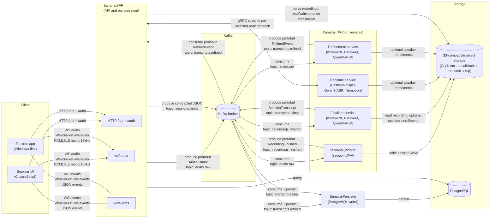
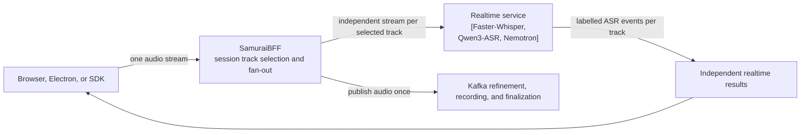

# [nanosamur.ai](https://nanosamur.ai)
guarding your sensitive conversations</sub>

<sub>Your voice. Your control.</sub>

## **Complete speech AI platform**
- open source
- production-grade, distributed architecture
- model agnostic
- multitenancy support

nanosamur.ai guards sensitive conversations in infrastructure you control. 

It is a model-agnostic orchestration platform that supports different models for
realtime, refined, and batch processing and provides a unified stack for robust
speech processing, agentic workflows, and webhooks.

Batteries included: we have a browser UI, a windows Electron app, API,
SDK, recording storage, persistence, and optional local observability.

This is the public front-door repository for running Community Edition locally
with Docker Compose. Service images are pulled from `ghcr.io/nanosamurai/*` and
pinned by source SHA.

## Demo - See it in action

<a href="https://nanosamur.ai/#demo">
  
</a>

[Watch nanosamur.ai](https://nanosamur.ai/#demo) turn a live conversation into speaker-aware transcripts, workflow results, a searchable final record, and a fully traced session. 

## What nanosamur.ai includes


- browser UI and SamuraiBFF API
- Windows-first Electron wrapper
- one or more independently selectable **realtime transcription** models:
  - nvidia/nemotron-3.5-asr-streaming
  - Qwen/Qwen3-ASR (streaming)
  - faster-whisper (in "pseudo-streaming" mode)
- **batch** and **semi-batch** processing using one or multiple models:
  - whisper
  - nvidia/parakeet-tdt v3
  - Qwen/Qwen3-ASR
- diarization (currently Pyannote or Sortformer), vad, alignment
- multi-tenancy support
- recording storage and full-session final transcripts
- PostgreSQL transcript persistence
- Python SDK and CLI source
- optional Grafana, Prometheus, Tempo, Loki, and Alloy stack
- public smoke tests and trace-context audit

The public code also includes agentic-workflow and webhook contracts.
Community Edition does not currently ship workflow execution or webhook delivery
services, but you are free to implement your own workflows / webhook services and plug them in.
<br clear="right">


## Architecture



Each speech-service box groups independently deployed, selectable tracks for
that stage; brackets list the supported model pipelines. Multiple selected
tracks produce separate labelled results. The [model matrix](#model-pipelines-in-the-supplied-stack)
below covers default and optional providers, model versions, alignment, and
diarization (pyannote or Sortformer). Speaker-enrollment access applies only to
pipelines that support it.

The stack consists of:

- [xamurai](https://github.com/nanosamurai/xamurai) contains the speech services:
  - `rtservice`, `qwen_rtservice` and `nemotron_rtservice`: realtime transcription.
  - `whisperx_worker`: one pipeline with refinement and finalizer entrypoints,
    built with `Dockerfile.refinement` and `Dockerfile.finalizer`.
  - `parakeet_worker`: Parakeet refinement and finalization with embedded Sortformer.
  - `qwen_worker`: batched vLLM refinement/finalization with pyannote speaker turns.
  - `nemo_speech_native`: native bindings and a shared Docker base for Nemotron and Parakeet.
  - `recorder_worker`: session audio storage.
  - `xamurai_serving.finalization`: the shared Kafka and recording loop for finalizers.
  - `xamurai_serving.refinement` and `refinement_runtime`: shared window buffering,
    publication and recovery for WhisperX, Parakeet and Qwen refinement.
- [samuraibff](https://github.com/nanosamurai/samuraibff) — HTTP/WebSocket API,
  browser UI, authentication, and orchestration
- [samuraipersistor](https://github.com/nanosamurai/samuraipersistor) —
  Kafka-to-PostgreSQL transcript persistence
- [nanosamurai-sdk](https://github.com/nanosamurai/nanosamurai-sdk) — Python
  SDK and CLI

Kafka carries audio and transcript events. PostgreSQL stores session and
transcript data. The evaluator uses LocalStack for S3-compatible recording and
speaker-enrollment storage; deployments can configure another S3-compatible
provider, such as AWS S3, Ceph RADOS Gateway, or MinIO.

See the [architecture guide](docs/architecture.md) for the request flow and
Community Edition boundary, including the object-storage replacement boundary.
API consumers should start with
[APIs and extension points](docs/apis-and-extension-points.md) for the generated
OpenAPI contract, Swagger UI, and BFF-owned protocol documentation.

## Multiple models, one audio stream

nanosamur.ai's aim is to provide a model-agnostic platform and to (as we progress) support more and more models (for all types of transcription modes). 
You can run multiple realtime speech models as peer providers behind
one API. SamuraiBFF accepts the audio once, fans it out to the models selected
for that session, and returns each result as a separate labelled track. The
models do not silently overwrite or blend one another.

This provides practical business and operational benefits:

- compare accuracy and latency on exactly the same conversation;
- introduce or evaluate a new model without replacing the established path;
- choose the best available provider set for a language, workload, or cost and
  latency target; and
- keep a slow or unavailable provider from blocking healthy realtime tracks.



The supplied base Compose stack starts the Faster-Whisper track. Add Qwen as a
second peer with the checked-in override:

```bash
docker compose -f docker-compose.yml -f docker-compose.qwen.yml pull
docker compose -f docker-compose.yml -f docker-compose.qwen.yml up -d
```

Both tracks are then available in the session settings, where an operator can
run Faster-Whisper, Qwen, or both. Concurrent models consume GPU memory and
compute independently, so capacity should be validated on the target hardware.
See [Evaluator getting started](docs/getting-started.md#evaluate-qwen-native-streaming)
for readiness checks and the tested profile.

An experimental source-build recipe adds the fixed Nemotron streaming profile
as two network-internal replicas. It is separate from the pinned quickstart;
no published Nemotron image pin is selected, and the existing base/Qwen image
pins stay unchanged. Build a compatible Xamurai image, then use the opt-in
override and its non-transcript-printing probe:

```bash
docker compose -f docker-compose.yml -f docker-compose.nemotron.yml \
  build nemotron-rtservice
docker compose -f docker-compose.yml -f docker-compose.nemotron.yml \
  up -d --no-deps nemotron-rtservice
docker compose --profile nemotron-validation \
  -f docker-compose.yml -f docker-compose.nemotron.yml \
  run --rm --no-deps nemotron-probe
```

See [Evaluator getting started](docs/getting-started.md#validate-nemotron-replicas)
for the full-stack BFF requirement and exact success checks.

### Model pipelines in the supplied stack

| Compose service | Stage / track ID | Default model pipeline | Result | Setup |
| --- | --- | --- | --- | --- |
| `rtservice` | Realtime / `faster-whisper` | `Systran/faster-whisper-medium` with `pyannote/speaker-diarization-3.1`; optional Silero VAD and enrolled-speaker mapping | Replaceable partials and timed, speaker-labelled realtime finals | Base stack |
| `qwen-rtservice` | Realtime / `qwen` | `Qwen/Qwen3-ASR-0.6B` through vLLM, `Qwen/Qwen3-ForcedAligner-0.6B`, and `pyannote/speaker-diarization-3.1` | Native-streaming partials and aligned, speaker-labelled epoch finals where alignment is supported; speakerless fallback otherwise | Qwen overlay, pinned image |
| `nemotron-rtservice` | Realtime / `nemotron` | `nvidia/nemotron-3.5-asr-streaming-0.6b` Q8 GGUF through NeMo-Speech.cpp; optional Sortformer v2 and WeSpeaker enrollment matching | Native partials and realtime finals; optional speaker turns and enrolled names | Nemotron overlay, source build |
| `whisperx_refinement` | Semi-batch refinement / `whisperx` | WhisperX `medium` with pyannote diarization and optional enrolled-speaker mapping; alignment disabled | Speaker-aware windows with segment timing, without word timing | Base stack |
| `whisperx_finalizer` | Completed recording / `whisperx` | The same WhisperX/pyannote pipeline with language-specific alignment enabled | Full-session transcript with word timing where alignment succeeds | Base stack |
| `parakeet-refinement` | Semi-batch refinement / `parakeet` | `nvidia/parakeet-tdt-0.6b-v3` Q8 with Sortformer v2 through NeMo-Speech.cpp | Native word timing and up to four anonymous speakers per window | Parakeet overlay, source build |
| `parakeet-finalizer` | Completed recording / `parakeet` | The same Parakeet/Sortformer pipeline | Full-session transcript with native word timing and up to four anonymous speakers per recording | Parakeet overlay, source build |
| `qwen-refinement` / `qwen-finalizer` | Semi-batch refinement / completed recording; `qwen` | `Qwen/Qwen3-ASR-0.6B` through vLLM with pinned Qwen forced alignment and pyannote diarization | Batched, speaker-labelled segments with word timing for final playback highlighting | Qwen workers overlay, source build |
| `recorder_worker` | Recording | No inference model | Session WAV and recording-completion event | Base stack |

The base and Qwen quickstarts pull pinned images. The optional Nemotron and
Parakeet recipes build from a compatible Xamurai checkout; merging source changes
does not advance those quickstart pins. Follow the [Parakeet refinement runbook](docs/parakeet-refinement.md)
for compatible BFF/Persistor prerequisites and rebuilding both WhisperX and
Parakeet workers with the shared runtime.

WhisperX, Parakeet and Qwen each have one inference pipeline with separate refinement
and finalizer entrypoints, images and processes. They share refinement
buffering/publication/recovery and the finalizer Kafka/recording loop. Nemotron
and Parakeet also share `nemo-speech-native`, a build dependency with zero runtime
replicas. Shared code and artifact caches do not share loaded model weights.

Refinement and final tracks are selected independently; omitted selections keep
WhisperX as the default. Parakeet supports no enrolled names, and its speaker
labels restart for each refinement window. Matching labels across windows do
not establish the same speaker. Realtime finals commit an utterance or window;
full-session final transcripts are separate results.

These are the profiles supplied by the project, not model IDs accepted from an
untrusted client. Xamurai owns the detailed service contract and implementation;
see its [realtime provider guide](https://github.com/nanosamurai/xamurai/blob/master/docs/modular-asr-providers.md).


## Quickstart

Prerequisites:

- Docker Desktop or Docker Engine
- Docker Compose v2
- free disk space for the selected images and speech models
- an NVIDIA container runtime and suitable GPU
- a least-privilege `HF_TOKEN` for required gated models

Create the local environment file:

```bash
cp .env.example .env
```

Windows PowerShell:

```powershell
Copy-Item .env.example .env
```

Set `HF_TOKEN` in `.env`, then start the complete evaluator stack:

```bash
docker compose pull
docker compose up -d
docker compose ps --all
```

Open <http://127.0.0.1:8000/live>, select **Microphone**, and choose
**Record now**. Realtime results appear first; refined and final results arrive
asynchronously.

Model downloads and cold initialization can take several minutes. The speech
services request `gpus: all`; the default stack requires an NVIDIA GPU available
to Docker.

See
[Evaluator getting started](docs/getting-started.md) for success checks,
Windows/Linux instructions, the tested hardware disclosure, observability, and
safe reset commands.

## Optional observability


Start the local observability services with:

```bash
docker compose -f docker-compose.yml -f docker-compose.observability.yml up -d
```

The stack provisions Grafana with Prometheus, Loki, and Tempo data sources.
Prometheus also scrapes NVIDIA GPU utilization, framebuffer memory, temperature,
and power metrics from the bundled DCGM exporter.
Kafka carries W3C trace context so asynchronous session work can be correlated
across SamuraiBFF, the Python workers, SamuraiPersistor, Kafka, and PostgreSQL.

See [Operations and observability](docs/operations-and-observability.md) for
endpoints, available signals, trace behavior, and current limitations.

## Documentation

The unmerged lean track UI spike is described in
[Track selection and local browser validation](docs/track-selection-ui.md).

- [Documentation index](docs/README.md)
- [Evaluator getting started](docs/getting-started.md)
- [Transcription lifecycle](docs/transcription-lifecycle.md)
- [APIs and extension points](docs/apis-and-extension-points.md)
- [Architecture and Community Edition boundary](docs/architecture.md)
- [Authentication and bring-your-own Keycloak](docs/authentication.md)
- [Operations and observability](docs/operations-and-observability.md)
- [Deployment and security boundaries](docs/deployment-and-security.md)
- [Smoke tests and release rehearsal](docs/smoke-tests.md)
- [Troubleshooting](docs/troubleshooting.md)
- [Image release policy](docs/image-release-policy.md)

Detailed API, WebSocket, SDK, speech-service, and persistence contracts remain
in their owning component repositories.

## Deployment boundary

Docker Compose is the supported public evaluation path. The containerized
services can be adapted to Kubernetes, but this repository does not supply
production Kubernetes manifests or charts.

Speech processing can run without a cloud speech API after container images,
models, and other dependencies have been staged. The normal quickstart
downloads those artifacts and is not a turnkey air-gap installation procedure.
See [Deployment and security boundaries](docs/deployment-and-security.md).

## Security

- All published host ports bind to `127.0.0.1` by default through
  `COMPOSE_BIND_IP`.
- The evaluator uses fixed development credentials and disables authentication
  for quick local access.
- Authenticated deployments must supply and operate their own Keycloak. See
  [Authentication and bring-your-own Keycloak](docs/authentication.md) for the
  required client, claims, tenant provisioning, and configuration.
- Do not expose this configuration to a LAN or public interface unless you intentionally want to do that.
- Never commit `.env`, tokens, recordings, transcripts, enrollment samples, or
  customer data.

The Compose credentials are intentionally fixed development values and are
safe only because services bind to localhost. This Compose stack is not a
production deployment manifest.

Report vulnerabilities privately as described in [SECURITY.md](SECURITY.md).
Contribution guidance is in [CONTRIBUTING.md](CONTRIBUTING.md).

## License

Licensed under the Apache License 2.0. See [LICENSE](LICENSE) and
[NOTICE](NOTICE).

## Refinement spike

The opt-in [refinement track runbook](docs/refinement-tracks-spike.md) describes
source builds, migration 019 and the local Compose qualification. It retains
the original stack and volumes. Track selection UI remains a separate spike.
