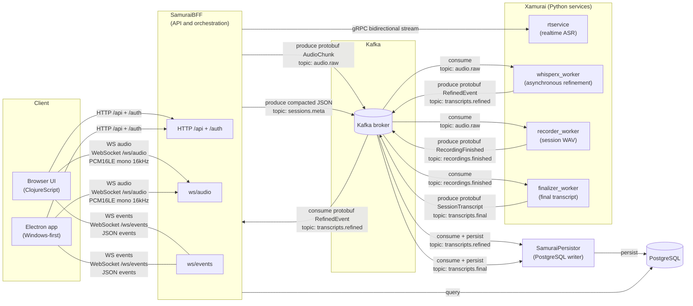

# nanosamur.ai 
guarding your sensitive conversations</sub>

<sub>Your voice. Your control.</sub>

## **Complete speech AI platform**
- open source
- production-grade, distributed architecture
- multitenancy support

nanosamur.ai guards sensitive conversations in infrastructure you control. 

It is model agnostic orchestration platform that supports different models used for different use cases (realtime vs semi-realtime vs batch) and provides a unified stack for highly available and robust processing with support for agentic workflows and webhooks. 

Batteries included: we have a browser UI, a windows Electron app, API,
SDK, recording storage, persistence, and optional local observability.

This is the public front-door repository for running Community Edition locally
with Docker Compose. Service images are pulled from `ghcr.io/nanosamurai/*` and
pinned by source SHA.

## What Community Edition includes


- browser UI and SamuraiBFF API
- Windows-first Electron wrapper
- realtime transcription with replaceable partial hypotheses
- asynchronous speaker-aware refinement
- multi-tenancy support
- recording storage and full-session final transcripts
- PostgreSQL transcript persistence
- Python SDK and CLI source
- optional Grafana, Prometheus, Tempo, Loki, and Alloy stack
- public smoke tests and trace-context audit

The public code also includes agentic-workflow and webhook contracts.
Community Edition does not ship workflow execution or webhook delivery
services, but you are free to implement your own workflows / webhook services and plug them in.
<br clear="right">

## Architecture



The stack consists of:

- [xamurai](https://github.com/nanosamurai/xamurai) — this is a monorepo with all speech-to-text (STT) services, namely:
  - real time STT (rtservice)
  - semi-realtime STT (whisperx_worker)
  - batch STT (finalizer_worker)
  - recording service (recorder_worker)
- [samuraibff](https://github.com/nanosamurai/samuraibff) — HTTP/WebSocket API,
  browser UI, authentication, and orchestration
- [samuraipersistor](https://github.com/nanosamurai/samuraipersistor) —
  Kafka-to-PostgreSQL transcript persistence
- [nanosamurai-sdk](https://github.com/nanosamurai/nanosamurai-sdk) — Python
  SDK and CLI

Kafka carries audio and transcript events. PostgreSQL stores session and
transcript data. The local setup uses LocalStack S3 for recordings.

See the [architecture guide](docs/architecture.md) for the request flow and
Community Edition boundary.

## Quickstart

Prerequisites:

- Docker Desktop or Docker Engine
- Docker Compose v2
- free disk space for the selected images and speech models
- an NVIDIA container runtime and suitable GPU for the speech profile
- a least-privilege `HF_TOKEN` for required gated models

Create the local environment file:

```bash
cp .env.example .env
```

Windows PowerShell:

```powershell
Copy-Item .env.example .env
```

Start the base stack:

```bash
docker compose pull
docker compose up -d
docker compose ps --all
```

Open <http://127.0.0.1:8000>. The base stack starts the UI/API and supporting
services but does not transcribe audio.

Set `HF_TOKEN` in `.env`, then start the GPU speech workers:

```bash
docker compose --profile speech up -d
```

Open <http://127.0.0.1:8000/live>, select **Microphone**, and choose
**Record now**. Realtime results appear first; refined and final results arrive
asynchronously.

Model downloads and cold initialization can take several minutes. The supplied
speech profile requests `gpus: all`. See
[Evaluator getting started](docs/getting-started.md) for success checks,
Windows/Linux instructions, the tested hardware disclosure, observability, and
safe reset commands.

## Optional observability

Start the local observability services with:

```bash
docker compose -f docker-compose.yml -f docker-compose.observability.yml --profile speech up -d
```

The stack provisions Grafana with Prometheus, Loki, and Tempo data sources.
Kafka carries W3C trace context so asynchronous session work can be correlated
across SamuraiBFF, the Python workers, SamuraiPersistor, Kafka, and PostgreSQL.

See [Operations and observability](docs/operations-and-observability.md) for
endpoints, available signals, trace behavior, and current limitations.

## Documentation

- [Documentation index](docs/README.md)
- [Evaluator getting started](docs/getting-started.md)
- [Transcription lifecycle](docs/transcription-lifecycle.md)
- [APIs and extension points](docs/apis-and-extension-points.md)
- [Architecture and Community Edition boundary](docs/architecture.md)
- [Authentication and bring-your-own Keycloak](docs/authentication.md)
- [Operations and observability](docs/operations-and-observability.md)
- [Deployment and security boundaries](docs/deployment-and-security.md)
- [Smoke tests and release rehearsal](docs/smoke-tests.md)
- [Troubleshooting](docs/troubleshooting.md)
- [Image release policy](docs/image-release-policy.md)

Detailed API, WebSocket, SDK, speech-service, and persistence contracts remain
in their owning component repositories.

## Deployment boundary

Docker Compose is the supported public evaluation path. The containerized
services can be adapted to Kubernetes, but this repository does not supply
production Kubernetes manifests or charts.

Speech processing can run without a cloud speech API after container images,
models, and other dependencies have been staged. The normal quickstart
downloads those artifacts and is not a turnkey air-gap installation procedure.
See [Deployment and security boundaries](docs/deployment-and-security.md).

## Security

- All published host ports bind to `127.0.0.1` by default through
  `COMPOSE_BIND_IP`.
- The evaluator uses fixed development credentials and disables authentication
  for quick local access.
- Authenticated deployments must supply and operate their own Keycloak. See
  [Authentication and bring-your-own Keycloak](docs/authentication.md) for the
  required client, claims, tenant provisioning, and configuration.
- Do not expose this configuration to a LAN or public interface unless you intentionally want to do that.
- Never commit `.env`, tokens, recordings, transcripts, enrollment samples, or
  customer data.

The Compose credentials are intentionally fixed development values and are
safe only because services bind to localhost. This Compose stack is not a
production deployment manifest.

Report vulnerabilities privately as described in [SECURITY.md](SECURITY.md).
Contribution guidance is in [CONTRIBUTING.md](CONTRIBUTING.md).

## License

Licensed under the Apache License 2.0. See [LICENSE](LICENSE) and
[NOTICE](NOTICE).
