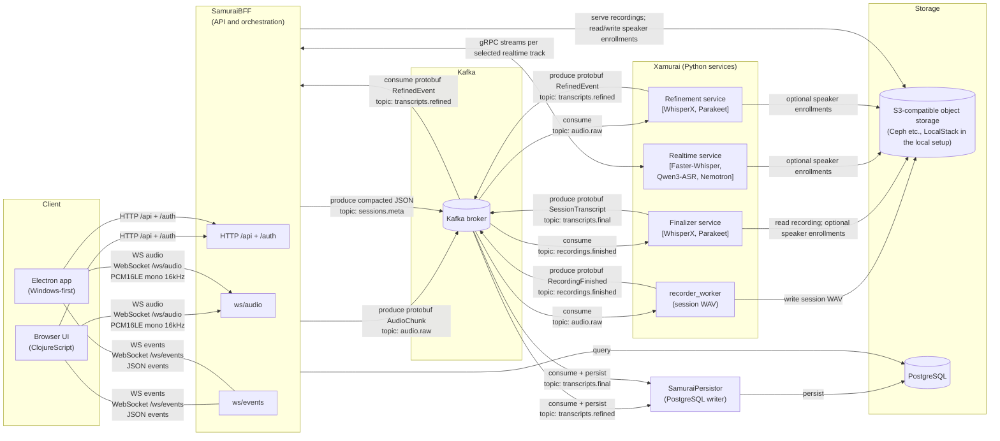

# Architecture and Community Edition boundary

The `nanosamurai` repository is the local Docker Compose front door for the
open-source speech-to-text services. It contains deployment wiring, development
infrastructure, smoke tests, and optional observability configuration; service
source code remains in the related repositories.

## Request and event flow

1. A browser or SDK creates and streams a session through SamuraiBFF.
2. SamuraiBFF fans realtime audio out to each configured peer Xamurai gRPC
   service using the common `RealtimeASR` API.
3. Audio and session events are published to Kafka with W3C trace context.
4. The recorder writes completed session audio to S3-compatible object
   storage; the evaluator supplies LocalStack for this role.
5. Selected refinement services process audio windows
   and produce separate track-labelled events on `transcripts.refined`.
6. Selected finalizers read the completed recording and produce separate
   full-session tracks on `transcripts.final`.
7. SamuraiPersistor stores transcript events in PostgreSQL.

Each speech-service box groups independently deployed, selectable tracks for
that stage; brackets list the supported model pipelines. Multiple selected
tracks produce separate labelled results. The [model matrix](../README.md#model-pipelines-in-the-supplied-stack)
covers default and optional providers, model versions, alignment, and
diarization (pyannote or Sortformer). Speaker-enrollment access applies only to
pipelines that support it.

The optional OpenTelemetry Collector sends traces to Tempo and metrics to
Prometheus. Alloy forwards container logs to Loki. Grafana is provisioned with
local data sources and a starter BFF dashboard.

The BFF publishes each accepted chunk to Kafka once, irrespective of how many
realtime tracks are configured. Each realtime track has an independent bounded
queue and stream, so one failed or lagging peer does not stop the others. The
base stack registers only Faster-Whisper; `docker-compose.qwen.yml` adds Qwen
as a second internal peer. The live UI receives the configured stable track IDs
and lets each session select a non-empty subset. Omission selects all tracks for
compatibility; simultaneous tracks are labelled and rendered side by side.
Results remain independent rather than being automatically merged or voted on.
This makes side-by-side evaluation, gradual model adoption, and workload-specific
selection possible without duplicating client audio or the Kafka recording and
refinement path. The public-facing model matrix and dual-track startup command
are in the [main README](../README.md#multiple-models-one-audio-stream).

The diagrams include optional providers: the Nemotron overlay adds a realtime
peer, and the Parakeet overlay adds independently selected refinement and final
tracks. See the [model matrix](../README.md#model-pipelines-in-the-supplied-stack)
for pinned-image versus source-build setup. WhisperX and Parakeet reuse shared
refinement and finalization runtimes, with separate model processes and consumer
groups. Parakeet refinement needs no recording-storage access; its finalizer
reads the shared recording. Neither Parakeet worker matches enrolled speakers.

## Replaceable object storage

Object storage is a configured service boundary, not a requirement to deploy
LocalStack. The supplied Compose file uses LocalStack because it provides a
small, reproducible localhost evaluator. The application services communicate
through the S3 API and can instead target AWS S3 or an S3-compatible
implementation such as Ceph RADOS Gateway or MinIO.

The base Compose file is the tested public path and hardcodes its LocalStack
endpoint, development credentials, region, and path-style addressing in the
service containers. Only the bucket names are parameterized there. To use an
external object store, supply a Compose override or equivalent deployment
configuration and provision the buckets outside this repository. Keep these
configuration groups consistent across every consumer:

| Responsibility | Consumers | Configuration |
| --- | --- | --- |
| Recordings and speaker-enrollment API access | SamuraiBFF | `SAMURAIBFF_S3_*`, including the recordings and enrollments bucket and prefix settings |
| Recording writes | recorder worker | `RECORDING_STORAGE_BACKEND=s3`, `S3_ENDPOINT`, `S3_BUCKET`, `S3_REGION`, credentials, `S3_FORCE_PATH_STYLE`, and `S3_PREFIX` |
| Recording reads | finalizer worker | `S3_ENDPOINT`, `S3_REGION`, credentials, and `S3_FORCE_PATH_STYLE`; the bucket and key come from the recording's `s3://` URL |
| Speaker-enrollment reads | realtime, WhisperX, and finalizer workers | `ENROLL_BACKEND=s3_manifest` and `ENROLL_S3_*`, including bucket and prefix |

Use the endpoint and addressing style required by the selected provider. Use
provider credentials only when needed; outside the evaluator, prefer the
provider's workload-identity or default credential chain where the owning
service supports it. Recording and enrollment bucket names and prefixes must
match between writers and readers.

LocalStack also exposes a Secrets Manager endpoint, and the evaluator configures
SamuraiBFF's webhook secret-store adapter to use it. The initialization script
does not create any secrets, and the webhook APIs that would write them are
disabled in default Community Edition mode. This role is therefore normally
idle in the supplied evaluator. Ceph RADOS Gateway, MinIO, or another
S3-compatible store replaces only object storage; it does not provide an AWS
Secrets Manager API. See [Production secret management](deployment-and-security.md#production-secret-management)
before enabling webhook integrations or deploying outside the evaluator. This
repository does not provide or claim a tested Ceph deployment.

## Community Edition scope

Included by default:

- local browser UI and BFF API
- realtime, refined, and final speech processing
- transcript persistence and local recording storage
- public smoke tests and Kafka trace-context audit
- local Grafana, Prometheus, Tempo, and Loki stack

Not included or enabled:

- workflow execution services
- webhook delivery services
- production Kubernetes and cloud infrastructure automation
- production identity integration, managed hosting, or operational support

Workflow and webhook contracts can remain visible in service source code, but
the corresponding runtime consumers are disabled by Community Edition feature
flags.

## Security boundary

Compose uses fixed development credentials and disables authentication by
default for a quick localhost evaluation. All host ports use
`COMPOSE_BIND_IP=127.0.0.1` by default. Do not expose this configuration to a
LAN, public interface, or production environment.
