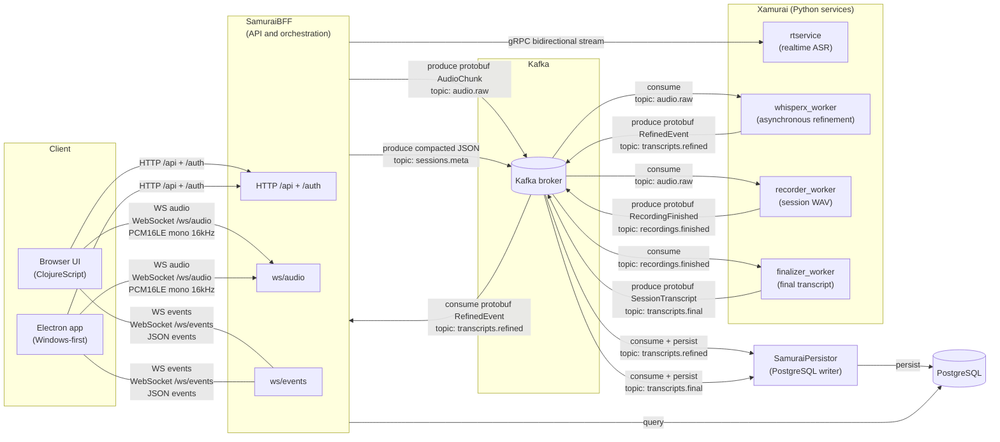

# Architecture and Community Edition boundary

The `nanosamurai` repository is the local Docker Compose front door for the
open-source speech-to-text services. It contains deployment wiring, development
infrastructure, smoke tests, and optional observability configuration; service
source code remains in the related repositories.

## Request and event flow

1. A browser or SDK creates and streams a session through SamuraiBFF.
2. SamuraiBFF sends realtime audio to the Xamurai gRPC service.
3. Audio and session events are published to Kafka with W3C trace context.
4. The recorder writes completed session audio to LocalStack S3.
5. WhisperX produces asynchronously refined transcript events.
6. The finalizer reads completed recordings and produces final transcript
   events.
7. SamuraiPersistor stores transcript events in PostgreSQL.

The optional OpenTelemetry Collector sends traces to Tempo and metrics to
Prometheus. Alloy forwards container logs to Loki. Grafana is provisioned with
local data sources and a starter BFF dashboard.

## Community Edition scope

Included by default:

- local browser UI and BFF API
- realtime, refined, and final speech processing
- transcript persistence and local recording storage
- public smoke tests and Kafka trace-context audit
- local Grafana, Prometheus, Tempo, and Loki stack

Not included or enabled:

- workflow execution services
- webhook delivery services
- production Kubernetes and cloud infrastructure automation
- production identity integration, managed hosting, or operational support

Workflow and webhook contracts can remain visible in service source code, but
the corresponding runtime consumers are disabled by Community Edition feature
flags.

## Security boundary

Compose uses fixed development credentials and disables authentication by
default for a quick localhost evaluation. All host ports use
`COMPOSE_BIND_IP=127.0.0.1` by default. Do not expose this configuration to a
LAN, public interface, or production environment.
