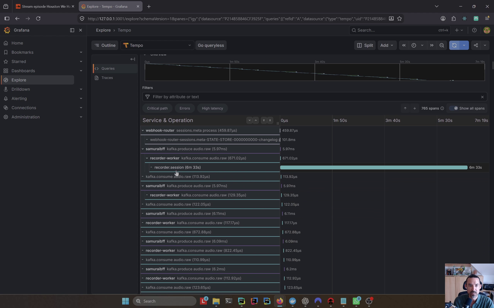

# Operations and observability

The Community Edition Compose stack includes health checks, structured logs,
Prometheus metrics, OpenTelemetry traces, and an optional local observability
environment. These tools are intended to make evaluation and development
diagnosable; they are not a substitute for production operations.



## Start the observability stack

Run the default stack with the observability override:

```bash
docker compose \
  -f docker-compose.yml \
  -f docker-compose.observability.yml \
  up -d
```

Windows PowerShell can use the same command on one line:

```powershell
docker compose -f docker-compose.yml -f docker-compose.observability.yml up -d
```

Local endpoints:

| Service | URL | Purpose |
| --- | --- | --- |
| Grafana | <http://127.0.0.1:3001> | Dashboards and exploration |
| Prometheus | <http://127.0.0.1:9090> | Metrics |
| Loki | <http://127.0.0.1:3100> | Logs |
| Tempo | <http://127.0.0.1:3200> | Traces |

Grafana uses development-only `admin` / `admin` credentials in the evaluator
configuration.

## Health and readiness

SamuraiBFF exposes:

- `GET /health` for process liveness
- `GET /ready` for critical dependency readiness

Readiness checks PostgreSQL, Kafka, and every configured realtime gRPC service. SamuraiBFF
starts gracefully when a dependency is unavailable and reports degraded
readiness while retrying the affected integration.

SamuraiPersistor exposes its own `/health` and `/ready` endpoints. Operational
probes are unauthenticated and must remain network-restricted.

## Metrics

Prometheus scrapes SamuraiBFF, Xamurai's realtime service, and NVIDIA DCGM
Exporter in the supplied configuration.

Available signals include:

- HTTP request counts and latency
- JVM and process metrics
- active realtime streams
- audio, chunk, and stream counters
- engine-feed, event-send, and VAD latency
- GPU utilization, framebuffer memory, temperature, and power (`DCGM_*`)

DCGM Exporter is available only when Docker has access to an NVIDIA GPU. It is
granted `SYS_ADMIN`, which its embedded DCGM hostengine needs to read GPU
fields. Its port is not published to the host; Prometheus reaches it only over
the private Compose network.

Useful Prometheus queries include:

```promql
DCGM_FI_DEV_GPU_UTIL
DCGM_FI_DEV_FB_USED
```

The asynchronous Python workers do not yet expose dedicated Prometheus
endpoints. Their processing remains visible through traces and logs. Do not
claim complete worker-metric coverage until those endpoints exist.

SamuraiBFF's metrics endpoint is intended for internal scraping and must not be
published as a public API.

## Traces

Services export OpenTelemetry spans to the local collector and Tempo. Kafka
messages carry W3C `traceparent` headers, allowing one session trace to include:

- SamuraiBFF
- recorder worker
- WhisperX refinement worker
- finalizer worker
- SamuraiPersistor
- Kafka and database operations

The realtime gRPC service currently remains on the connected request trace
rather than the deterministic Kafka/session trace. This is a known continuity
gap, not a loss of realtime tracing.

Use the public trace audit after a Tier 3 or Tier 4 smoke session:

```bash
python utilities/k8s_local_smoke_test/kafka_traceparent_audit.py \
  --kafka-bootstrap 127.0.0.1:9092 \
  --session-id <session-uuid>
```

## Logs and correlation

SamuraiBFF and SamuraiPersistor use structured logging. Useful correlation
fields include:

- `trace_id`
- `span_id`
- `session_id`
- `tenant_id`
- `user_id`
- Kafka topic, partition, and offset
- HTTP route

Transcript text is not logged at INFO by default. Before sharing diagnostics,
remove tokens, transcript text, recording locations, tenant/user identifiers,
and customer data.

## Smoke-test tiers

The public smoke tests are cumulative:

| Tier | Validates |
| --- | --- |
| 1 | BFF HTTP connectivity |
| 2 | WebSocket and realtime ASR |
| 3 | Session audio reaches Kafka with trace context |
| 4 | Recording, refined, or final asynchronous output |

Use [Smoke tests and release rehearsal](smoke-tests.md) for installation and
commands. Strict final validation is opt-in because cold model and alignment
startup can take several minutes.

## Routine inspection

Start with:

```bash
docker compose ps --all
docker compose logs --tail=100 samuraibff samuraipersistor
```

For a speech worker:

```bash
docker compose logs --tail=200 rtservice
docker compose logs --tail=200 whisperx_worker
docker compose logs --tail=200 recorder_worker
docker compose logs --tail=200 finalizer_worker
docker compose -f docker-compose.yml -f docker-compose.observability.yml logs --tail=100 dcgm_exporter
```

Use [Troubleshooting](troubleshooting.md) for image access, port conflicts, GPU
startup, gated models, cold starts, and migration failures.

## Operational limitations

- The supplied stack runs one container per explicitly named service and is not
  a horizontal-scaling manifest.
- LocalStack and fixed credentials are suitable only for localhost evaluation.
- GPU telemetry requires the NVIDIA container runtime and grants the local
  DCGM exporter `SYS_ADMIN`; do not reuse that container definition across an
  untrusted multi-tenant Docker host.
- Async-worker Prometheus endpoints are not yet present.
- Realtime gRPC and deterministic session traces are not yet one continuous
  trace.
- First model and alignment initialization can be slow.
- The Compose observability override downloads the OpenTelemetry Java agent on
  first start unless it has been staged in advance.

See [Deployment and security boundaries](deployment-and-security.md) before
adapting the stack beyond a local evaluator.
